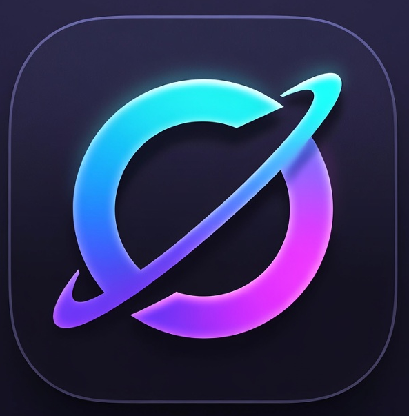
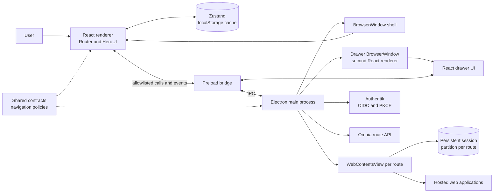
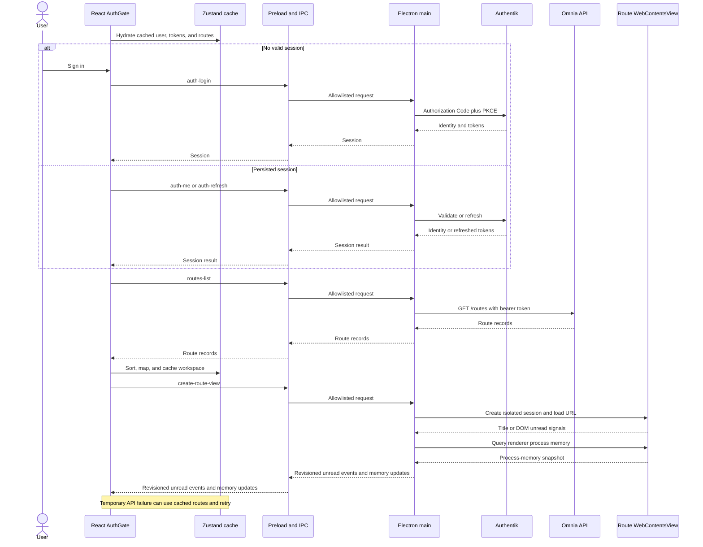

# Omnia

<p align="center">
  
</p>

Omnia is an Electron desktop workspace for web applications. It keeps tools
such as mail, chat, media, and AI assistants in one window while giving every
configured application its own persistent Chromium session.

This is a host for existing websites, not a native API aggregation layer.
Omnia does not merge inboxes or reproduce third-party data; each route displays
the provider's web application and remains subject to that provider's login,
browser-support, and network requirements.

## The problem

A workday often spans several browser applications with different accounts,
notification models, and resource costs. Keeping them as ordinary tabs makes
context switching easy but gives the user little control over isolation,
layout, or memory use.

Omnia explores a desktop-shell approach:

- keep each service signed in through a dedicated session partition;
- switch between one route, a horizontal spread, or a matrix layout;
- hibernate an unused route without deleting its cookies;
- surface best-effort unread counts and per-route memory estimates; and
- keep a cached workspace available when the Omnia route API is temporarily
  unavailable.

The route picker currently provides presets for Gmail, Slack, Discord,
Telegram, WhatsApp, Microsoft Teams, Messenger, Spotify, TradingView, X,
ChatGPT, and Claude. These are URL and navigation-policy presets rather than
guarantees of permanent third-party compatibility.

Product screenshots are intentionally omitted because this repository
currently contains only branding icons, not suitable UI screenshots.

## Architecture

Omnia separates trusted Electron capabilities from the untrusted UI and hosted
pages.



| Area                       | Responsibility                                                                                                                   |
| -------------------------- | -------------------------------------------------------------------------------------------------------------------------------- |
| `src/main.ts`, `src/main/` | Electron lifecycle, native windows and views, sessions, permissions, IPC, OAuth, API requests, unread state, and process memory. |
| `src/preload.ts`           | Small context-isolated bridge with an explicit IPC channel allowlist.                                                            |
| `src/renderer/`            | React interface, routing, layouts, drawer UI, session bootstrap, and Zustand stores.                                             |
| `src/common/`              | Route/drawer contracts, URL policies, mapping, and utilities shared across process boundaries.                                   |

The IPC API is allowlisted but generically typed; it is not yet modeled as a
channel-by-channel request/response schema.

### Startup and route data flow



## Important engineering decisions

| Decision                                 | Why                                                                                                    | Trade-off                                                                                                                                                                    |
| ---------------------------------------- | ------------------------------------------------------------------------------------------------------ | ---------------------------------------------------------------------------------------------------------------------------------------------------------------------------- |
| Use `WebContentsView` instead of iframes | Hosted apps receive a full Chromium context, media support, and independent sessions.                  | Native views live outside the React DOM, so bounds, stacking, lifecycle, and layout must be synchronized manually. Each active route also costs a Chromium renderer process. |
| Give every route a `persist:` partition  | Cookies and account state cannot leak between configured routes; hibernation can preserve login state. | Storage must be managed explicitly. Deleting a route clears its partition, while hibernating only closes the view.                                                           |
| Put OAuth and route HTTP calls in main   | Centralizes timeouts/retries and avoids renderer CORS concerns.                                        | The renderer still owns persisted bearer tokens and passes them over the scoped bridge.                                                                                      |
| Use a separate child window for drawers  | Management UI can appear above native route views and remain independent of their page content.        | Main, shell renderer, and drawer renderer coordinate a duplicated state snapshot over IPC.                                                                                   |
| Cache renderer state with Zustand        | Startup hydration and temporary backend-offline use stay simple.                                       | Access and refresh tokens currently live in renderer localStorage rather than an OS credential vault.                                                                        |
| Infer unread state from pages            | Avoids requiring a separate provider API integration for every service.                                | Page-title and DOM selectors are best effort and may break when a provider changes its UI or localization.                                                                   |
| Use Castlabs Electron                    | Its component build supports DRM-dependent hosted media such as Spotify.                               | The project follows a nonstandard Electron distribution and download mirror instead of upstream Electron releases.                                                           |

Navigation is constrained by per-integration internal-host rules. External HTTP,
HTTPS, mail, and telephone targets are opened by the operating system; media and
notification permissions are limited to trusted route origins. Main windows use
context isolation with Node integration disabled, and packaged builds enable
ASAR integrity-related Electron fuses.

## Technology choices

- Electron 40 Castlabs component build, Electron Forge 7, and Vite 5 for the
  main, preload, and renderer build targets.
- React 19 and React Router 7 for renderer composition and navigation.
- Zustand 5 for small persisted application and authentication stores.
- HeroUI 3, Tailwind CSS 4, and React Icons for the interface.
- TypeScript 6 with `noImplicitAny` enabled across main, preload, shared, and
  renderer code.
- Vitest 3, Testing Library, and jsdom for unit and component tests.
- ESLint, TypeScript, V8 coverage, and `@barney-media/crap-typescript` for the
  automated quality gate.

## Local setup

### Prerequisites

- Node.js 24, matching CI
- npm (the lockfile and scripts are npm-based)
- Git

Linux also needs the normal Electron runtime libraries. Packaging an Arch
package additionally requires `makepkg`.

### Install and run

```bash
git clone https://github.com/padsbanger/omnia.git
cd omnia
npm ci
npm start
```

The hosted defaults work without a local `.env`. To make configuration
explicit, copy the example before starting:

```powershell
Copy-Item .env.example .env
```

On macOS or Linux, use `cp .env.example .env`.

| Variable                 | Purpose                                                | Default                           |
| ------------------------ | ------------------------------------------------------ | --------------------------------- |
| `AUTHENTIK_CLIENT_ID`    | Public OIDC native-client identifier.                  | Hosted Omnia client ID            |
| `AUTHENTIK_REDIRECT_URI` | Exact OAuth callback handled by the modal auth window. | `omnia://auth/callback`           |
| `OMNIA_API_BASE_URL`     | Route CRUD API base URL.                               | `https://omnia.pripyat.cloud`     |
| `OMNIA_BUILD_PACMAN`     | Force or disable the optional Arch maker.              | Auto-detects `makepkg` when unset |

The first three values configure the Electron main process. Forge also loads
`.env`, so `OMNIA_BUILD_PACMAN` applies while `npm run make` evaluates the
available makers; the example file pins it to `false` for predictable builds.

The Authentik discovery URL is currently fixed in `src/main/authApi.ts`. A
self-hosted identity provider therefore requires a code/configuration change,
not only an environment variable.

### Useful commands

| Command                 | Purpose                                                              |
| ----------------------- | -------------------------------------------------------------------- |
| `npm start`             | Start Electron Forge and Vite in development mode.                   |
| `npm test`              | Run the Vitest suite once.                                           |
| `npm run test:coverage` | Run tests and emit text plus Istanbul JSON coverage.                 |
| `npm run lint`          | Lint TypeScript and TSX.                                             |
| `npm run typecheck`     | Run TypeScript without emitting files.                               |
| `npm run crap`          | Enforce the function-level CRAP threshold of 8 using coverage.       |
| `npm run quality`       | Run lint, typecheck, coverage, CRAP, and a production package build. |
| `npm run package`       | Package the application for the current host without an installer.   |
| `npm run make`          | Create configured distributables for the current host.               |

## Testing and quality

Tests cover shared URL/route policies, unread parsing and badge behavior,
settings, route API failure paths, session verification, and React component
behavior. Electron and network boundaries are mocked in the test suite.

Pull requests and pushes to `main` run this sequence on Node 24:

```text
lint -> typecheck -> tests with coverage -> CRAP gate -> package
```

The CRAP gate is set to 8 and consumes the coverage file produced by the same
test run. The repository does not claim a coverage percentage or performance
benchmark. There is currently no automated full-Electron end-to-end test; use
`npm start` for a native smoke test.

## Deployment and releases

Electron Forge builds only for the current host. Configured makers are:

| Host                      | Output                     |
| ------------------------- | -------------------------- |
| Windows                   | Squirrel installer/package |
| macOS                     | ZIP archive                |
| Linux                     | ZIP archive                |
| Arch Linux with `makepkg` | Optional Pacman package    |

A pushed Git tag triggers `.github/workflows/build-and-release.yml`. It first
runs lint, typecheck, coverage, and the CRAP gate, then builds on Windows,
macOS, and Ubuntu and attaches the generated files to a GitHub Release. The
workflow intentionally disables the optional Pacman maker on Ubuntu, so the
automated Linux release is a ZIP.

The workflow does not bake identity or API settings into the JavaScript bundle.
Published artifacts fall back to the hosted defaults in source unless they are
launched with runtime environment values. A self-hosted distributable that must
work without launch-time configuration needs an explicit build-time mechanism
or source changes. There is no code-signing, notarization, or automatic-update
configuration; release artifacts should therefore be treated as unsigned
packages.

## Observability

Observability is local and diagnostic rather than a remote monitoring system:

- main and renderer failures are written to their development consoles;
- Authentik and route API calls have 20-second timeouts; discovery and initial
  route loading use bounded retries;
- each loaded route reports an approximate Chromium process-memory snapshot
  after load and every 15 seconds, visible in route management;
- revisioned unread state updates the sidebar, document title, and supported OS
  application badges; and
- render-process termination is logged by the main process.

There is no structured log persistence, crash reporting, telemetry export,
distributed tracing, or health endpoint. The unread console-message protocol is
an internal page-to-main signal, not an observability backend.

## Known limitations

- Hosted integrations can regress when providers change browser policy, OAuth
  flows, titles, DOM structure, or supported Chromium versions.
- Offline mode preserves cached route configuration; it does not make hosted
  web applications available offline. Create, rename, and delete are
  unavailable offline. Reordering changes only the local cache and is not
  queued, so server order can replace it after reconnecting.
- Every active route has a Chromium-backed view and can consume substantial
  memory. Hibernation mitigates that cost but does not make it disappear.
- Access and refresh tokens are stored in renderer localStorage, not an OS
  credential store.
- Route mutations span a remote API and local native-view state without a
  transaction. Reordering is optimistic and currently has no rollback UI.
- The preload channel list is explicit, but payloads lack runtime schema
  validation and channel-specific TypeScript signatures.
- Release packages are unsigned and not notarized; no automatic updater is
  implemented.
- There are no automated Electron end-to-end tests, live provider contract
  tests, persistent logs, crash reports, or suitable product screenshots.
- The Authentik and route-service server implementations are external to this
  repository.

## Further reading

- [CASE_STUDY.md](CASE_STUDY.md) explains the most difficult engineering
  problems, the implemented solutions, and the remaining risks.
- [DESIGN.md](DESIGN.md) is a shorter implementation-oriented architecture
  reference.

## License

Omnia is available under the [MIT License](LICENSE).
